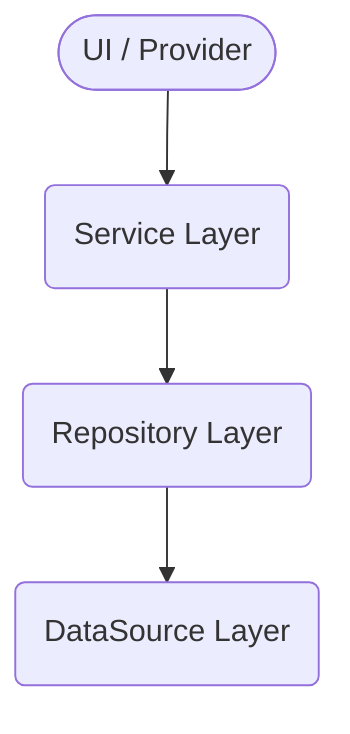

version: "2025-07-29"
last\_updated\_by: docs-bot
depends\_on: \[codex\_context.yaml]

# 🔗 Service Dependency Guidelines

> **Purpose**
> Describe the approved dependency graph for **data sources → repositories → services → UI** so that Codex‑generated code never violates architectural boundaries.

---

## Layered architecture

| Layer                  | Description                                             | Examples                                            |
| ---------------------- | ------------------------------------------------------- | --------------------------------------------------- |
| **DataSource**         | Raw I/O with Firestore, REST, cache, device APIs        | `FirestoreBetDataSource`, `SecureStorageDataSource` |
| **Repository**         | Aggregates & transforms data sources into domain models | `BetRepository`, `UserRepository`                   |
| **Service / Use‑case** | Stateless business logic orchestrating repositories     | `AuthService`, `BetService`, `CoinService`          |
| **UI / Provider**      | Riverpod providers, ViewModels & Widgets                | `BetScreenViewModel`, `HomeTab`                     |

---

## Allowed dependencies

* UI **may depend on** Service & Provider layers only.
* Services depend **only on** repositories; **no service-to-service** calls (except `AuthService` may be injected for token refresh).
* Repositories depend on one or more data sources.
* Data sources have **no higher‑level dependencies**.

---

## Dependency Injection rules

1. Use **Riverpod** for all DI – no global singletons.
2. Provider naming convention:

   * `dataSource` – `<name>DataSourceProvider`
   * `repository` – `<name>RepositoryProvider`
   * `service` – `<name>ServiceProvider`
3. Services are constructed with `ref.read(<RepositoryProvider>)` inside their provider.
4. **Do not** call `context.read()` inside services – UI context is forbidden at these layers.

---

## Testing strategy

| Layer      | Test type       | Technique                                          |
| ---------- | --------------- | -------------------------------------------------- |
| DataSource | Integration     | Firebase emulator / mock HTTP                      |
| Repository | Unit            | Fake data source injected via provider override    |
| Service    | Unit            | Fake repository overrides, business rules asserted |
| UI         | Widget / Golden | Provider overrides for service fakes               |

---

## Quick checklist

| ✅ Check                                 | How to verify                                   |
| --------------------------------------- | ----------------------------------------------- |
| UI does **not** import repository class | `grep -R "import .*Repository" lib/ui` → 0 hits |
| Service uses only repositories          | Static analysis (`flutter analyze`) passes      |
| No cyclic deps in providers             | `dart run dependency_validator` clean           |

---

## Changelog

| Date       | Author   | Notes                    |
| ---------- | -------- | ------------------------ |
| 2025-07-29 | docs-bot | Initial document created |
