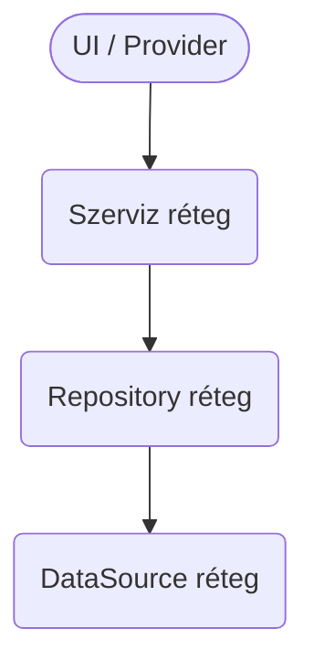

version: "2025-07-29"
last\_updated\_by: docs-bot
depends\_on: \[codex\_context.yaml, service\_dependencies\_en.md]

# 🔗 Szervizfüggőségi irányelvek

> **Cél**
> Meghatározni a jóváhagyott függőségi gráfot **adatforrások → repositoryk → szervizek → UI** között, hogy a Codex által generált kód ne sértse az architekturális határokat.

---

## Rétegzett architektúra

| Réteg                  | Leírás                                                       | Példák                                              |
| ---------------------- | ------------------------------------------------------------ | --------------------------------------------------- |
| **DataSource**         | Nyers I/O Firestore‑ral, REST-tel, cache-el, eszköz API-kkal | `FirestoreBetDataSource`, `SecureStorageDataSource` |
| **Repository**         | Összegyűjti és domain‑modellekké alakítja a data source-okat | `BetRepository`, `UserRepository`                   |
| **Szerviz / Use‑case** | Állapotmentes üzleti logika, repository-k orchestrálása      | `AuthService`, `BetService`, `CoinService`          |
| **UI / Provider**      | Riverpod providerek, ViewModel-ek és Widgetek                | `BetScreenViewModel`, `HomeTab`                     |

---

## Engedélyezett függőségek

* A UI **csak** szervizektől / providerektől függhet.
* A szervizek **csak** repositoryktól függhetnek; **nincs szerviz→szerviz** hívás (kivétel `AuthService`, ha tokenfrissítéshez szükséges).
* A repositoryk egy vagy több data source-ra támaszkodnak.
* A data source rétegnek **nincs felfelé mutató függése**.

---

## Dependency Injection szabályok

1. Minden DI-hoz **Riverpod**‑ot használunk – globális singleton tilos.
2. Provider névkonvenció:

   * `dataSource` – `<name>DataSourceProvider`
   * `repository` – `<name>RepositoryProvider`
   * `service` – `<name>ServiceProvider`
3. A szerviz konstrukciója a providerben történik `ref.read(<RepositoryProvider>)` hívással.
4. **Ne** használd a `context.read()`-ot szervizben – az UI-kontekstus tiltott ezeken a rétegeken.

---

## Tesztstratégia

| Réteg      | Teszttípus      | Technika                                               |
| ---------- | --------------- | ------------------------------------------------------ |
| DataSource | Integrációs     | Firebase emulátor / mock HTTP                          |
| Repository | Unit            | Fake data source provider override-dal                 |
| Szerviz    | Unit            | Fake repository override, üzleti szabályok ellenőrzése |
| UI         | Widget / Golden | Szerviz-fake provider override                         |

---

## Gyors ellenőrző lista

| ✅ Ellenőrizd                              | Hogyan?                                            |
| ----------------------------------------- | -------------------------------------------------- |
| UI **nem** importál repository-osztályt   | `grep -R "import .*Repository" lib/ui` → 0 találat |
| Szerviz csak repositorykat használ        | Statikus analízis (`flutter analyze`) hibátlan     |
| Nincs ciklikus függés a providerek között | `dart run dependency_validator` tiszta             |

---

## Változásnapló

| Dátum      | Szerző   | Megjegyzés      |
| ---------- | -------- | --------------- |
| 2025-07-29 | docs-bot | Első dokumentum |
